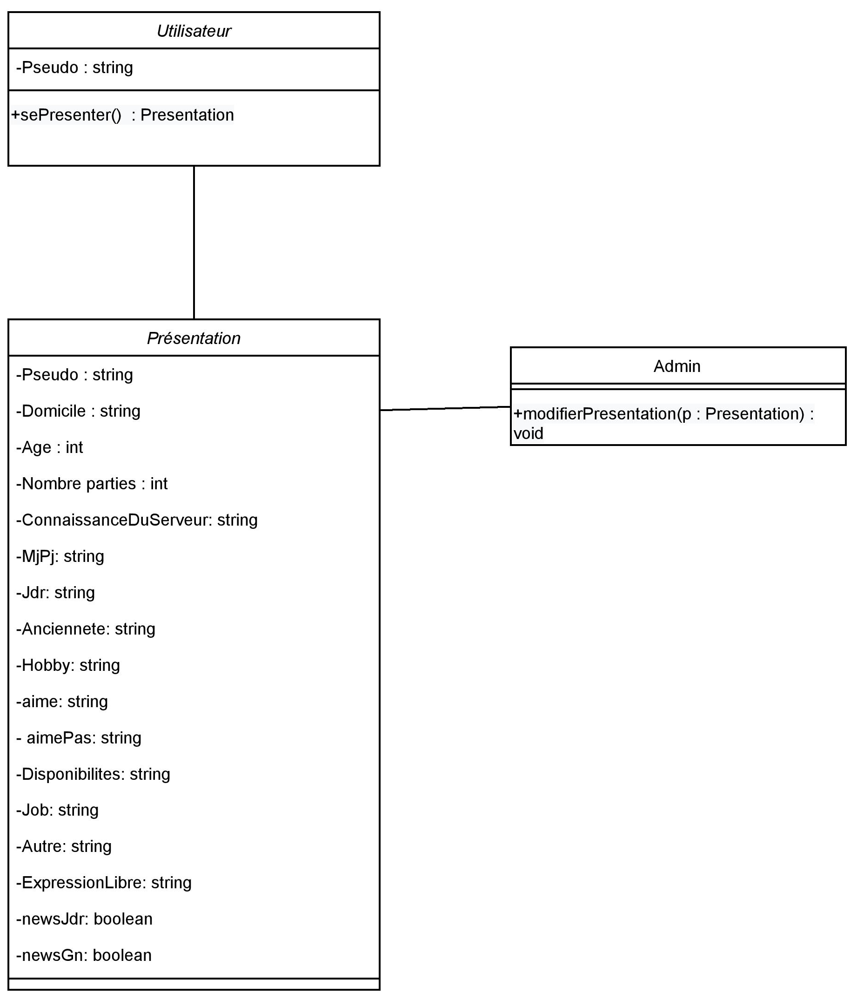

[](https://forthebadge.com) [](https://forthebadge.com) [](https://forthebadge.com) 

**Vous trouverez ci-dessous les informations importantes concernant les bots Discord de l'association [Union des Rôlistes](http://unionrolistes.fr) :)**

---
## Sommaire
1. [LE PROJET](#le-projet)

2.1 [BOT_BASE](#bot_base) 
- 2.1.1 [Fonction](#fonction--)
- 2.1.2 [Astuce](#astuce-)

2.2 [BOT_PLANNING](#bot_planning)
- 2.2.1 [Utilisation](#utilisation-)

2.3 [BOT_PRESENTATION](#bot_presentation)
- 2.2.2 [Utilisation](#utilisation--1)

3. [INSTALLER ET CONFIGURER LE PROJET EN ENTIER](#installer-et-configurer-le-projet-en-entier)
- 3.1 [Prérequis](#prérequis-)
- 3.2 [Démarche](#démarche-)
  - 3.2.1 [Créer, personnaliser et configurer tous les bots](#1-créer-personnaliser-et-configurer-tous-les-bots-)
  - 3.2.2 [Installer un environnement d'hébergement (avec une machine Linux-Ubuntu)](#2-installer-un-environnement-dhébergement-avec-une-machine-linux-ubuntu-)
  - 3.2.3 [Initialiser le bot](#3-initialiser-le-bot-)

4. [MAINTENANCE](#maintenance-)

5. [DÉVELOPPEMENT](#développement-)
- 5.1 [Grafcet Bot_Planning](#grafcet-bot_planning-)
- 5.2 [Grafcet Bot_Presentation](#grafcet-bot_presentation-)

6. [CRÉDITS, PARTICIPANTS ET ORGANISATION](#crédits-participants-et-organisation)


---
---
## Le projet
Le projet regroupe trois bots Discord, qui sont Bot_Base, Bot_Planning et Bot_Presentation. 

Ils ont chacun un but précis, que vous pouvez trouver en défilant un peu plus la page. 

L'ensemble conformise les présentations des utilisateurs et facilite l'annonce d'un évènement.


---
## Bot_Base
### Fonction : 
Ce programme **regroupe les développements** communs à [Bot_Planning](https://github.com/UnionRolistes/Bot_Planning_python) et [Bot_Presentation](https://github.com/UnionRolistes/Bot_Presentation). 

II **facilite** ainsi **l'installation et la maintenance** des bots.

### Astuce :
Il est à noter que [Bot_Planning](#bot_planning) et [Bot_Presentation](#bot_presentation) fonctionnent tous deux de la manière suivante :

 - Un utilisateur entre une commande, qui lui retournera un formulaire en ligne auquel il doit se connecter via discord pour remplir les informations qu'il souhaite.


 - Les données entrées sont envoyé (via webhook) au bot en question, qui met les informations renseignées en forme et les envoie ensuite dans le salon approprié. 


 - De la même manière, le formulaire envoyé par chaque bot est constitué sur la base d'un message déjà envoyé. 
Il suffit à l'administrateur du bot de l'initialiser avec la commande **$set <id-message-exemple>**. 
     

---
## Bot_Planning
### Utilisation :
1. L'utilisateur écrit la commande **$cal**. 
En message privé, il reçoit un lien web vers un formulaire adapté à la création d'événement.


2. Après avoir reçu les informations renseignées, le bot les met en forme et les publie dans le salon "planning".


3. Une fois publique, l'annonce est encore modifiable ; il suffit d'y répondre sur discord avec la commande **$edit**.


---
## Bot_Presentation
### Utilisation :
1. L'utilisateur écrit la commande **$prez**.
En message privé, il reçoit un lien web vers un formulaire figurant des questions sur son âge, ses passions, sa profession, etc.


2. Le bot met en forme les informations reçues par webhook et les publie dans le salon "presentation".


3. Une fois publique, la présentation est encore modifiable ; il suffit d'y répondre sur discord avec la commande **$edit**.
   

---
---
## Installer et configurer le projet en entier
## Prérequis :
- Posséder un système Linux-Ubuntu. Si vous possédez un système Windows, alors vous devrez [créer une machine virtuelle](https://www.youtube.com/watch?v=1kZmKhWJtcE) (tuto réalisé par [Numelion-IT](https://www.youtube.com/@numelionIT))
avec une image iso telle téléchargeable [ici](https://www.ubuntu-fr.org/download/).


- Posséder un serveur où héberger les bots.

```
P.s : L'accès aux programmes est gratuit tant que vous l'hébergez vous-même.
À contrario, l'association Union des Rôlistes est prête à vous fournir ce service pour un euro mensuel.
Si tel est le cas, contactez l'administrateur de l'association (mentions en bas de page) sans suivre ce tutoriel.
```


- Posséder un bot discord (démarche expliquée dans la section ci-dessous)


---
## Démarche :
### 1. Créer, personnaliser et configurer tous les bots :
- Rendez-vous sur [ce lien](https://discord.com/developers/applications) et connectez-vous à Discord. 


- Cliquez en haut à droite sur le bouton "New Application". 


- Donnez un nom à votre bot. Lisez et accepter les licences qui vous sont données.


- Configurez votre bot à vos envies et vos besoins.


- Chercher le token unique à votre bot. Pour se faire : cliquez à gauche sur la section "Bot" et ensuite sur "Reset Token". Acceptez et noter la longue suite de caractères (vous en aurez besoin à l'étape 3). 

```
P.s : À noter qu'en perdant le token, vous devrez le reset à nouveau !
De plus, quiconque possédant cet identifiant unique, garde le contrôle total sur le bot. Faîte donc attention !
```

### 2. Installer un environnement d'hébergement (avec une machine Linux-Ubuntu) :
À partir du système Ubuntu, ouvrir le terminal et installer toutes les mises à jour disponibles et les dépendances nécessaires, soit : 
   - Nettoyer et mettre à jour le système :

``` sudo apt update ; sudo apt upgrade -y ; sudo apt full-upgrade -y ; sudo apt autoremove -y ; sudo apt clean ```

   - Apache2 et Git : 

``` sudo apt install apache2 -y ; sudo apt install git -y ```

   - Python3.8 (version spécifique au projet) : 

``` sudo apt install software-properties-common ; sudo add-apt-repository ppa:deadsnakes/ppa ; sudo apt install python3.8 ```


### 3. Initialiser le bot :
- Dans le terminal, cloner le projet avec la commande suivante :

``` cd /usr/local/src && sudo git clone  https://github.com/UnionRolistes/Bot_Base  && cd Bot_Base && sudo bash updateBot.sh ```


- Quand le programme vous le demande : récupérez le token du bot (précédemment noté) et entrez-le seul au terminal.


- Une fois que vous lisez "Success!", invitez le bot - que vous aviez créée - sur le(s) serveur(s) de votre choix. 


- Pour ce faire, retournez sur [votre espace Discord-Développeurs](https://discord.com/developers/applications/),
section "Installation" et créez un lien d'invitation. 


- Accédez à ce dernier, choisissez la destination du bot et autorisez les permissions nécessaires.


- Enfin, véfiez que les permissions suivantes lui ont bien été attribuées : 
**Voir les salons**, **Gérer les webhooks**, **Envoyer des messages** et **Voir les anciens messages**.


### Félicitations ! Tous vos bots sont désormais prêts à l'emploi.
           

---

---
## Maintenance :
À des fins de sécurité et de performances, il est important de mettre à jour votre système et le projet.

Pour ce faire, accédez au terminal et entrez les commandes suivantes : 

``` sudo apt update ; sudo apt upgrade -y ; sudo apt full-upgrade -y ; sudo apt autoremove -y ; sudo apt clean ```

``` cd /usr/local/src/Bot_Base && sudo git checkout . && sudo git pull && sudo bash updateBot.sh ```

En cas de souci, ou si vous désirez suggérer une amélioration au programme, 
l'association Union des Rôlistes est disponible aux adresses mentionnées à la dernière section. 


---
---
## Développement :
Vous désirez nous venir en aide ? Merci ! 

Alors, vous trouverez ci-après les liens vers les dépôts GitHub de [Bot_Planning](https://github.com/UnionRolistes/Bot_Planning_python) et [Bot_Presentation](https://github.com/UnionRolistes/Bot_Presentation).

Le projet fonctionne grâce à cinq langages, qui sont **Python**, **XML** (eXtensible Markup Language), **HTML** (HyperText Markup Language), **CSS** (Cascading Style Sheets) et **Bash**.

Une question particulière ? L'association Union des Rôlistes est disponible aux adresses mentionnées à la dernière section du fichier.
   

---
### Grafcet Bot_Planning :

<details open>
<summary>Cliquer pour voir le grafcet en détail.</summary>
<br>

</details>


### Diagramme de classe Bot_Planning :


---
### Grafcet Bot_Presentation :

<details open>
<summary>Cliquer pour voir le grafcet en détail.</summary>
<br>

</details>


### Diagramme de classe Bot_Presentation


---
---
## Crédits, participants et organisation
**Le projet est encadré par l'équipe de développement de l'association Union-Rôlistes, qui garde une to-do list, 
dont le contenu est accessible à partir de [ce lien](https://github.com/orgs/UnionRolistes/projects/1/views/1).**
**Ci-après les crédits pour [Bot_Base](https://github.com/UnionRolistes/Bot_Base/blob/main/credits.md), 
[Bot_Planning](https://github.com/UnionRolistes/Bot_Planning_python/blob/master/src/cog_planning/info/credits.txt) et
[Bot_Presentation](https://github.com/UnionRolistes/Bot_Presentation/blob/master/src/cog_presentation/info/credits.txt).**

**Retrouvons-nous sur [ce site web](https://site.unionrolistes.fr), [sur facebook](https://www.facebook.com/union.rolistes/) 
ou grâce au [serveur discord de l'association](http://unionrolistes.fr).**
### À bientôt !